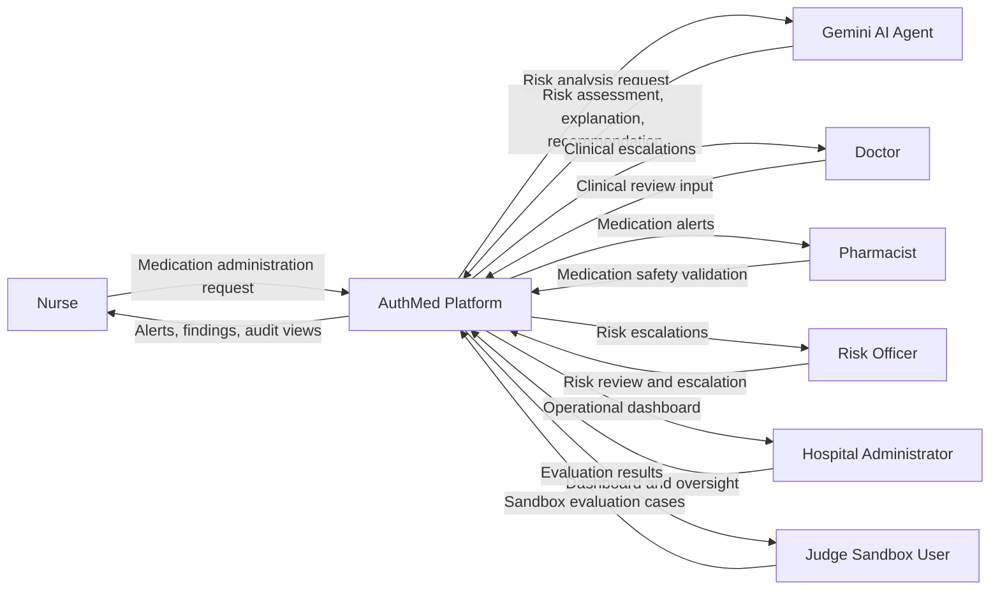
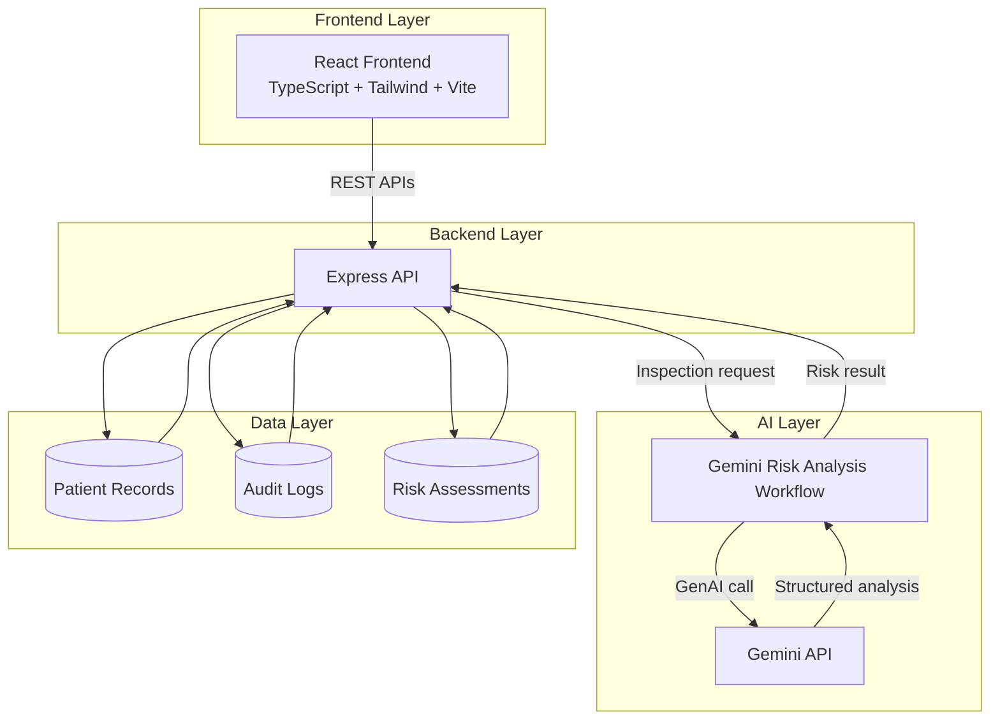
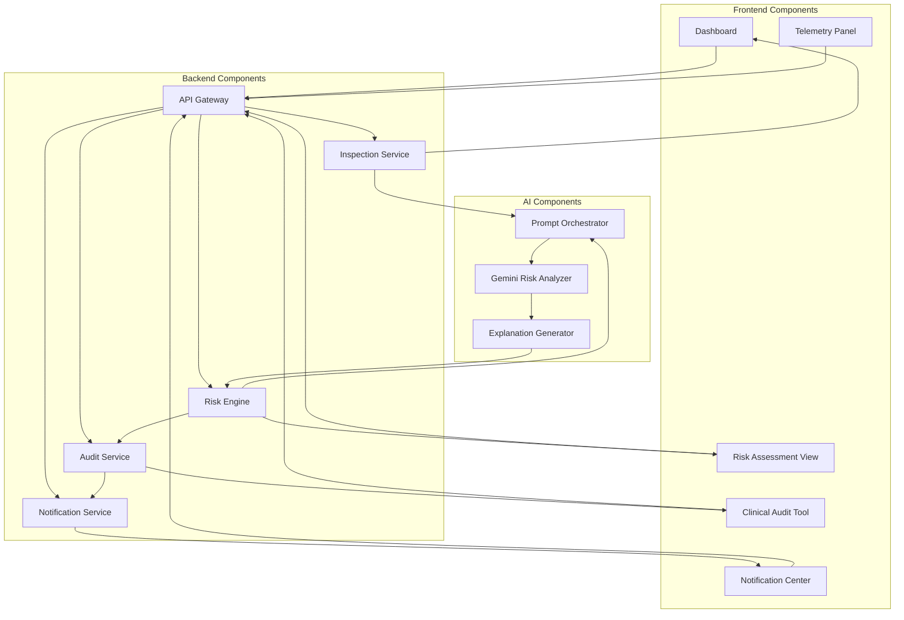
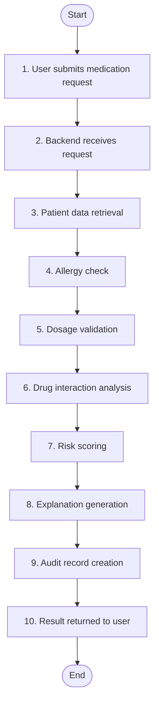
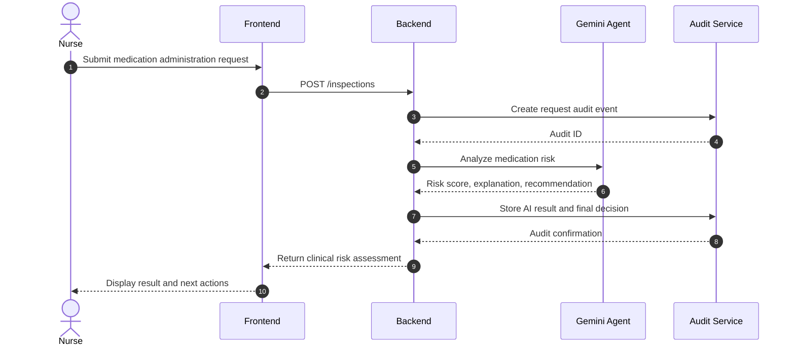
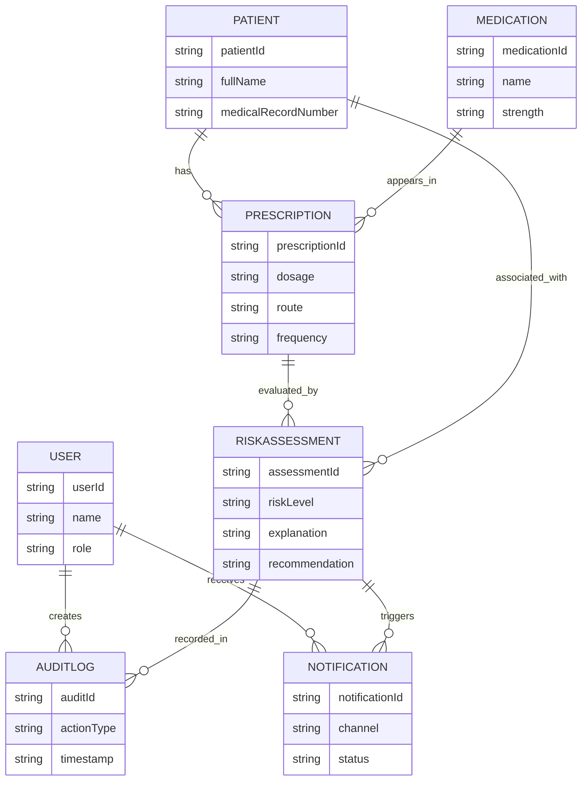
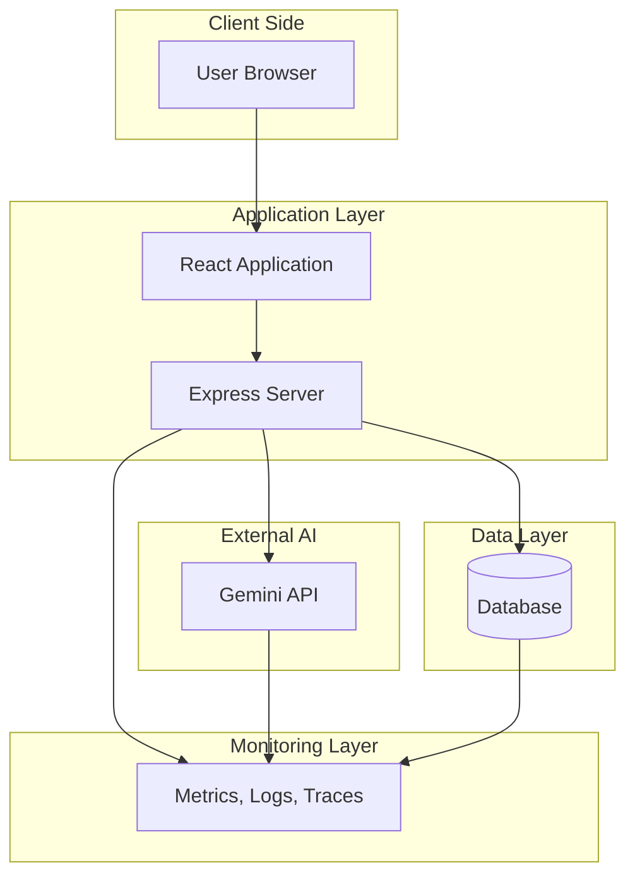
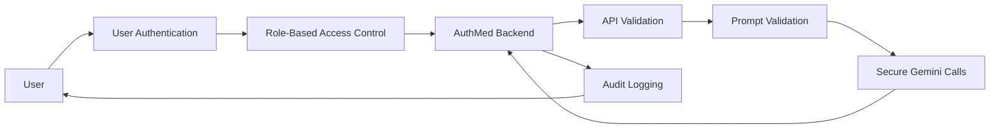
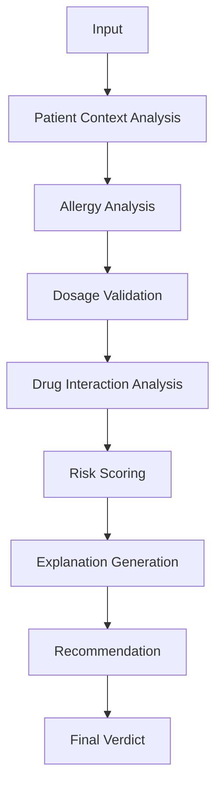
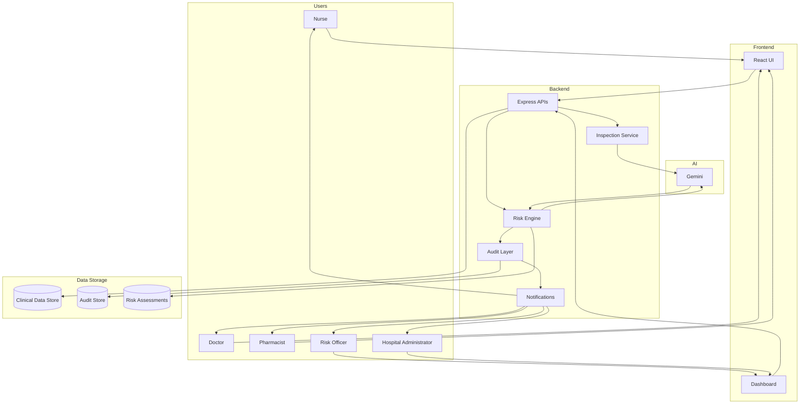

# AuthMed Mermaid Architecture Diagrams

## 1. System Context Diagram

This diagram shows the primary human actors, the AuthMed platform, and the Gemini AI agent that supports medication risk inspection and human-in-the-loop decision making.

## 2. High-Level Solution Architecture Diagram

This diagram shows the layered solution structure from the React frontend to the Express backend, Gemini AI integration, and the data layer holding patient records, audit logs, and risk assessments.

## 3. Component Architecture Diagram

This diagram breaks the platform into frontend, backend, and AI components so the implementation boundary remains explicit for GitHub documentation and later UML modeling.

## 4. Clinical Inspection Workflow Diagram

This workflow shows the end-to-end clinical inspection path from request submission through risk scoring, explanation generation, audit creation, and return of the result to the user.

## 5. Sequence Diagram

This sequence diagram captures the nurse-led submission flow and the interactions between the frontend, backend, Gemini agent, and audit service.

## 6. Data Model Diagram

This conceptual ER diagram shows the core MVP entities and their relationships without moving into physical schema design.

## 7. Deployment Diagram

This deployment view shows the runtime path from the browser to the React application, Express server, Gemini API, database, and monitoring layer.

## 8. Security Architecture Diagram

This diagram captures the primary security controls around authentication, request validation, prompt validation, audit logging, role-based access control, and secure Gemini communication.

## 9. Agent Workflow Diagram

This diagram shows the Gemini reasoning pipeline from raw input through contextual analysis, scoring, explanation generation, and the final verdict.

## 10. End-to-End Architecture Diagram

This final architecture diagram combines the full MVP path from users to dashboard, including the frontend, backend, Gemini AI, audit layer, notifications, and data storage.

